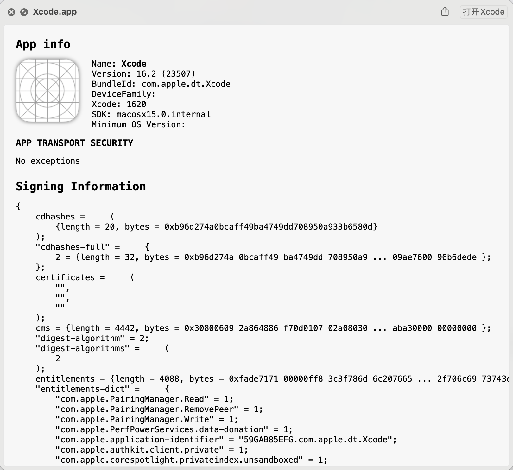

# ProvisionQL screenshots

## Thumbnails

## Provision

### Valid AdHoc provision

### Valid AppStore provision

### Expired AppStore provision

## Apps

### Xcode archive

### AdHoc ipa

### App Store ipa

### MacOS App

